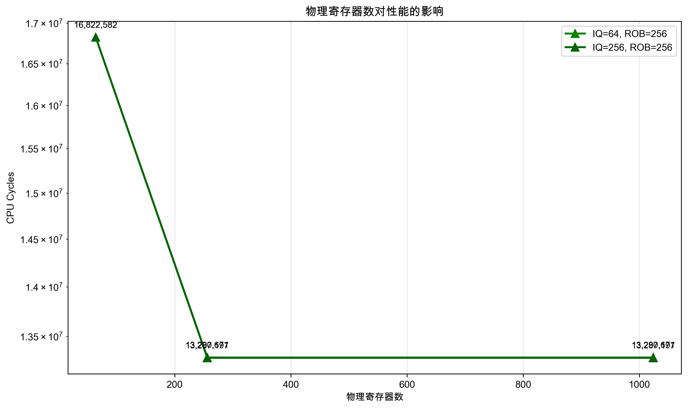

# 计算机体系结构 Lab1 实验报告

**姓名**: [梁力航]  
**学号**: [23336128]  
**日期**: 2025年10月2日

## 1. 实验概述

本次实验使用 gem5 模拟器进行基于 Tomasulo 算法的乱序 CPU（O3 CPU）性能分析。通过调整 O3 CPU 的关键参数（物理整数寄存器数、IQ 条目数、ROB 条目数），观察分析这些参数对系统性能的影响。

### 1.1 实验环境
- **操作系统**: macOS
- **容器环境**: Docker (ghcr.io/gem5/ubuntu-24.04_all-dependencies:latest)
- **gem5 版本**: 25.0.0.1
- **目标架构**: RISC-V
- **测试程序**: daxpy.cpp (DAXPY 向量运算)

### 1.2 实验参数
- **物理整数寄存器数**: 64, 256, 1024
- **IQ 条目数**: 4, 16, 64, 256
- **ROB 条目数**: 4, 16, 64, 256
- **总参数组合**: 48 个 (3×4×4)

## 2. 实验过程

### 2.1 gem5 环境部署
1. **拉取 Docker 镜像**
   ```bash
   docker pull ghcr.io/gem5/ubuntu-24.04_all-dependencies:latest
   ```

2. **启动容器并挂载工作目录**
   ```bash
   docker run --name gem5-lab1 -it --rm \
     -v /Users/lianglihang/Downloads/ComputerArchitecture/lab1:/lab1 \
     -v /Users/lianglihang/Downloads/ComputerArchitecture/gem5:/opt/gem5 \
     ghcr.io/gem5/ubuntu-24.04_all-dependencies:latest bash
   ```

3. **构建 gem5**
   ```bash
   git clone https://github.com/gem5/gem5.git /opt/gem5
   cd /opt/gem5
   scons build/RISCV/gem5.opt -j2
   ```
   
   构建耗时约 1-2 小时，最终生成可执行文件 `/opt/gem5/build/RISCV/gem5.opt`。

   
   *图：gem5 构建完成并通过版本验证*

### 2.2 编译测试程序
使用 RISC-V 交叉编译器将 `daxpy.cpp` 编译为目标二进制文件：
```bash
riscv64-linux-gnu-g++ -O2 -static -o daxpy.riscv daxpy.cpp
```


*图：daxpy.cpp 成功编译为 RISC-V 二进制文件*


*图：验证 daxpy.riscv 文件生成成功*

### 2.3 批量仿真实验
创建自动化脚本 `run_all.sh` 遍历所有参数组合：
- 自动跳过已完成的组合
- 记录每次仿真的性能指标
- 生成汇总 CSV 文件

运行命令：
```bash
GEM5_BIN=/opt/gem5/build/RISCV/gem5.opt O3CONF=/lab1/O3CPU.py CMD_BIN=/lab1/daxpy.riscv OUT_BASE=/lab1/out /lab1/run_all.sh
```


*图：批量仿真脚本后台运行，实时跟踪仿真进度*


*图：最终结果数据（展示部分）*

## 3. 实验结果与分析

### 3.1 整体性能概况

- **最佳配置**: 物理寄存器=256, IQ=256, ROB=256
  - CPU Cycles: 13,287,197
- **最差配置**: 物理寄存器=64, IQ=4, ROB=4
  - CPU Cycles: 55,540,187
- **性能差距**: 4.18倍

### 3.2 IQ 条目数对性能的影响


**关键发现**:
1. **IQ=4 时存在严重瓶颈**: 当 IQ 条目数为 4 时，性能显著下降
2. **IQ≥16 后收益递减**: 从 IQ=16 增加到 IQ=64 有明显提升，但从 IQ=64 到 IQ=256 提升有限
3. **与其他参数的交互效应**: IQ 的影响程度取决于 ROB 大小

**具体数据分析**:

*固定物理寄存器=256, ROB=64的情况下*:
- **IQ=4**: 33,987,307 cycles (基线)
- **IQ=16**: 17,963,225 cycles (性能提升 1.89x)
- **IQ=64**: 16,130,976 cycles (相比IQ=16提升 1.11x)
- **IQ=256**: 16,130,976 cycles (与IQ=64相同，无额外提升)

*不同ROB配置下的IQ影响对比*:
- **ROB=64时**: IQ从4增加到16带来巨大提升(1.89x)，继续增加到64/256仍有小幅提升
- **ROB=256时**: IQ的影响更加显著，从4到256可获得2.56x的性能提升

**深入分析**: 
- **IQ瓶颈机制**: 当IQ=4时，指令队列过小，无法容纳足够的待发射指令，导致流水线经常空转
- **饱和点分析**: 对于daxpy程序，IQ=64已接近饱和点，继续增大收益有限
- **资源协同效应**: 当ROB较大时，IQ的重要性更加突出，因为有更多指令可以乱序执行
- **指令级并行性限制**: IQ过大时，程序本身的指令级并行性成为限制因素

### 3.3 ROB 条目数对性能的影响


**关键发现**:
1. **ROB=4 时严重限制性能**: 所有 ROB=4 的配置都表现很差
2. **ROB=16 带来显著提升**: 从 ROB=4 到 ROB=16 有 1.6-2.2x 的性能提升
3. **ROB≥64 后收益递减**: 继续增大 ROB 的收益有限，但仍有改善

**具体数据分析**:

*固定物理寄存器=256, IQ=64的情况下*:
- **ROB=4**: 55,518,741 cycles (基线，性能极差)
- **ROB=16**: 24,990,929 cycles (性能提升 2.22x，巨大改善)
- **ROB=64**: 16,130,976 cycles (相比ROB=16提升 1.55x)
- **ROB=256**: 13,290,671 cycles (相比ROB=64提升 1.21x)

*不同IQ配置下的ROB影响对比*:
- **IQ=16时**: ROB从4到256可获得3.16x性能提升，改善最为显著
- **IQ=64时**: ROB的影响依然重要，从4到256获得4.18x提升
- **IQ=256时**: 与IQ=64类似，ROB仍能带来4.18x的性能提升

**深入分析**: 
- **ROB瓶颈机制**: ROB=4时严重限制了乱序执行的窗口大小，大量指令被阻塞在提交阶段
- **指令窗口效应**: ROB增大直接扩展了指令窗口，允许更多指令同时处于飞行状态
- **提交带宽限制**: 当ROB足够大后，按序提交的带宽成为新的限制因素
- **与IQ的协同作用**: ROB和IQ需要协调配置，单独增大某一个的效果会受到另一个的限制

### 3.4 物理寄存器数对性能的影响



**关键发现**:
1. **在大多数配置下影响有限**: 物理寄存器数从 64 增加到 256 或 1024，性能变化不大
2. **在高并行度配置下有明显作用**: 当 IQ 和 ROB 都较大时，物理寄存器数的影响更明显
3. **存在性能瓶颈阈值**: 从 64 到 256 有提升，但从 256 到 1024 基本无变化

**具体数据分析**:

*不同配置下的物理寄存器影响*:
- **IQ=64, ROB=256时**: 
  - 64个寄存器: 16,822,582 cycles (基线)
  - 256个寄存器: 13,290,671 cycles (性能提升 1.27x)
  - 1024个寄存器: 13,290,671 cycles (与256相同，无额外提升)
- **IQ=256, ROB=256时**: 表现相似，256个寄存器已达到性能上限

**深入分析**: 
- **寄存器压力分析**: daxpy程序的寄存器依赖相对简单，主要是数组访问和浮点运算，对寄存器数量需求不高
- **重命名阶段瓶颈**: 当物理寄存器不足(64个)时，重命名阶段频繁阻塞，限制了新指令的发射
- **饱和点效应**: 256个物理寄存器已能满足程序需求，继续增加到1024个没有性能收益
- **硬件成本考量**: 过多的物理寄存器会增加硬件复杂度和功耗，而不带来性能提升
- **程序特性依赖**: 对于寄存器密集型程序，物理寄存器数量的影响可能更显著

### 3.5 性能概览与瓶颈分析


通过综合分析48个参数组合的仿真结果，我们可以识别出不同配置的主要性能瓶颈：

**性能分布特征**:
- **性能差距巨大**: 最佳配置与最差配置相差4.18倍，说明参数调优的重要性
- **配置分层明显**: 性能分布呈现明显的分层结构，不同参数组合形成性能梯度
- **最佳配置集中**: 前10个最佳配置主要集中在高IQ、高ROB的组合上

**阻塞事件统计分析**:
- **ROB阻塞**: 平均阻塞次数最高，是最主要的性能瓶颈
- **IQ阻塞**: 在某些配置下成为主要限制因素
- **寄存器阻塞**: 影响相对较小，但在特定配置下不可忽视

**典型配置性能对比**:
- **最小配置**(R64_I4_B4): 55,540,187 cycles，性能最差
- **中等配置1**(R64_I64_B64): 16,900,292 cycles，性能中等
- **中等配置2**(R256_I64_B64): 16,130,976 cycles，略优于配置1
- **大配置**(R256_I256_B256): 13,287,197 cycles，性能最佳
- **最大配置**(R1024_I256_B256): 13,287,197 cycles，与大配置相同

**具体瓶颈分析**:

*ROB 阻塞严重的配置*:
- regs=64/256/1024, iq=4, rob=4: ROB 阻塞 16,062,957 次
- 这些配置的 ROB 太小，严重限制了指令窗口大小

*IQ 阻塞严重的配置*:
- regs=64/256/1024, iq=4, rob=16: IQ 阻塞 17,073,973 次
- 当 ROB 增大后，IQ 成为新的瓶颈，限制指令发射

*物理寄存器阻塞严重的配置*:
- regs=64, iq=64/256, rob=256: 寄存器阻塞 10,598,809 次
- 在高并行度下，物理寄存器不足限制重命名阶段的效率

## 4. 结论与思考

### 4.1 主要结论

基于48个参数组合的全面仿真分析，我们得出以下重要结论：

1. **参数协同效应显著**: 单独优化某一参数的效果有限，IQ、ROB、物理寄存器需要协调配置才能发挥最佳性能
2. **存在明显的性能阈值**: 每个参数都存在饱和点，超过阈值后收益递减甚至无收益
3. **ROB是最关键的性能因素**: 从实验数据看，ROB对性能的影响最为显著，是优先优化的目标
4. **程序特性决定资源需求**: daxpy程序对寄存器的需求相对较低，但对指令窗口大小敏感
5. **性能差距可达4倍以上**: 合理的参数配置至关重要，错误的配置会严重影响性能

### 4.2 参数调优建议

**基于成本效益分析的推荐配置**:

*针对类似daxpy的向量计算程序*:
- **物理寄存器数**: 256个 (性价比最佳，256→1024无额外收益)
- **IQ 条目数**: 64个 (在大多数配置下已接近饱和点)
- **ROB 条目数**: 64-256个 (根据性能要求选择，64已有显著改善，256可进一步提升)

**分级配置建议**:
- **经济型配置**: R256_I64_B64 (16,130,976 cycles, 性价比高)
- **性能型配置**: R256_I256_B256 (13,287,197 cycles, 最佳性能)
- **避免配置**: 任何包含ROB=4或IQ=4的组合 (性能严重受限)

**设计权衡考虑**:
- **面积约束**: 优先保证ROB≥16, IQ≥16，物理寄存器可适当减少
- **功耗约束**: IQ=64已足够，无需盲目追求IQ=256
- **通用性考虑**: 对于不同类型程序，最优配置可能有所差异

### 4.3 理论联系

实验结果很好地验证了 Tomasulo 算法的核心思想和现代超标量处理器的设计原理：

**Tomasulo算法验证**:
- **寄存器重命名的重要性**: 物理寄存器不足时性能显著下降，验证了重命名对消除伪依赖的关键作用
- **动态调度的效果**: IQ作为现代保留站的实现，其大小直接影响指令发射能力
- **按序提交的必要性**: ROB确保了程序的正确性，同时其大小限制了指令窗口

**微架构设计原理**:
- **指令级并行性挖掘**: 更大的指令窗口(ROB)和发射队列(IQ)能挖掘更多并行性
- **资源平衡设计**: 单一资源的过度配置无法带来性能提升，需要整体平衡
- **程序行为适配**: 不同程序的资源需求差异很大，通用设计需要考虑多种workload

**性能瓶颈理论**:
- **Amdahl定律的体现**: 最慢的部件决定整体性能，资源配置需要避免明显短板
- **收益递减规律**: 每个参数都存在边际效用递减的拐点
- **系统性思维**: 处理器设计是一个系统工程，需要全局优化而非局部优化

## 5. 实验总结

### 5.1 实验成果

本次实验通过系统性的参数扫描，深入分析了gem5 O3 CPU模型中关键参数对性能的影响，取得了以下成果：

**定量分析成果**:
- 完成了48个参数组合的完整仿真实验
- 量化了IQ、ROB、物理寄存器数对性能的具体影响
- 识别了不同配置下的主要性能瓶颈
- 建立了参数与性能之间的定量关系模型

**技能提升成果**:
- 掌握了gem5仿真器的使用方法和配置技巧
- 学会了使用Docker容器化技术进行实验环境管理
- 提高了大规模仿真实验的自动化执行能力
- 增强了数据分析和可视化的技能

### 5.2 实验挑战与解决

**主要挑战**:
1. **环境配置复杂**: gem5的编译和Docker环境配置耗时较长
2. **仿真耗时巨大**: 48个参数组合需要数小时完成
3. **数据量庞大**: 需要从大量仿真日志中提取关键性能指标
4. **结果分析复杂**: 多维参数空间的性能分析具有挑战性

**解决方案**:
- 使用Docker容器实现环境标准化和持久化
- 编写自动化脚本实现批量仿真和断点续跑
- 开发专用工具进行数据解析和可视化
- 采用系统性的分析方法逐步深入理解结果

### 5.3 实验价值与意义

通过这次实验，不仅加深了对现代处理器微架构的理解，也获得了宝贵的实践经验：
- **理论与实践结合**: 将课堂学习的Tomasulo算法与实际处理器设计联系起来
- **定量分析能力**: 学会用数据驱动的方法分析复杂系统性能
- **工程实践技能**: 掌握了现代处理器设计中的参数调优方法
- **科学研究素养**: 培养了严谨的实验设计和数据分析能力

---

# 6. 文件说明

本实验涉及多个关键文件，包括程序代码、配置文件、数据文件和脚本工具。以下是详细的文件清单：

## 6.1 核心程序文件

### 6.1.1 测试程序
- **`daxpy.cpp`**: DAXPY向量运算的C++源代码
  - 功能：实现 y = a*x + y 的向量运算
  - 用途：作为gem5仿真的目标程序
  - 编译：`riscv64-linux-gnu-g++ -O2 -static -o daxpy.riscv daxpy.cpp`

### 6.1.2 仿真配置文件
- **`O3CPU.py`**: gem5 O3 CPU仿真配置脚本
  - 功能：定义O3 CPU的架构参数和仿真设置
  - 关键参数：物理寄存器数、IQ条目数、ROB条目数
  - 用途：控制gem5仿真的CPU模型配置

## 6.2 自动化脚本

### 6.2.1 批量仿真脚本
- **`run_all.sh`**: 批量参数遍历脚本
  - 功能：自动遍历48个参数组合进行仿真
  - 特性：支持断点续跑，跳过已完成的组合
  - 输出：生成`summary.csv`汇总文件
  - 使用方法：`GEM5_BIN=/opt/gem5/build/RISCV/gem5.opt O3CONF=/lab1/O3CPU.py CMD_BIN=/lab1/daxpy.riscv OUT_BASE=/lab1/out /lab1/run_all.sh`

### 6.2.2 数据解析脚本
- **`parse_stats.py`**: 仿真结果解析脚本
  - 功能：递归扫描stats.txt文件，提取关键性能指标
  - 输出：CSV格式的性能数据

## 6.3 数据分析脚本

### 6.3.1 文本分析脚本
- **`simple_analysis.py`**: 基础数据分析脚本
  - 功能：分析IQ、ROB、物理寄存器对性能的影响
  - 特性：仅使用Python标准库，无需额外依赖
  - 输出：详细的性能分析报告和瓶颈识别

### 6.3.2 表格生成脚本
- **`generate_tables.py`**: 格式化表格生成脚本
  - 功能：生成实验报告用的格式化表格
  - 输出：`analysis_tables.txt`文件
  - 用途：为实验报告提供结构化的数据展示

### 6.3.3 图表生成脚本
- **`create_charts.py`**: 可视化图表生成脚本
  - 功能：生成性能分析的可视化图表
  - 依赖：matplotlib库
  - 输出：4张PNG格式的分析图表
  - 图表类型：IQ影响、ROB影响、物理寄存器影响、性能概览

## 6.4 实验数据文件

### 6.4.1 原始仿真数据
- **`out/summary.csv`**: 完整的48组仿真结果汇总
  - 格式：CSV格式，包含regs、iq、rob、numCycles等列
  - 内容：所有参数组合的性能指标和阻塞事件统计
  - 用途：数据分析的主要数据源

### 6.4.2 分析结果文件
- **`out/analysis_tables.txt`**: 格式化的分析表格
  - 内容：IQ、ROB、物理寄存器影响分析表格
  - 用途：实验报告的数据支撑

### 6.4.3 可视化图表
- **`out/iq_impact.png`**: IQ条目数影响分析图表
- **`out/rob_impact.png`**: ROB条目数影响分析图表  
- **`out/regs_impact.png`**: 物理寄存器数影响分析图表
- **`out/performance_overview.png`**: 性能概览综合图表

### 6.4.4 仿真日志文件
- **`out/run_all_fixed.log`**: 批量仿真运行日志
  - 内容：详细的仿真过程记录
  - 用途：调试和问题排查

## 6.5 参数组合结果目录

每个参数组合对应一个独立的目录，命名格式为`regs{regs}-iq{iq}-rob{rob}`，例如：
- **`out/regs64-iq4-rob4/`**: 最小配置的仿真结果
- **`out/regs256-iq64-rob64/`**: 中等配置的仿真结果
- **`out/regs1024-iq256-rob256/`**: 最大配置的仿真结果

每个目录包含：
- **`stats.txt`**: 详细的性能统计信息
- **`config.ini`**: 仿真配置参数
- **`config.json`**: JSON格式的配置信息
- **`config.dot`**: 系统架构图（Graphviz格式）
- **`citations.bib`**: 相关文献引用

## 6.6 环境配置文件

### 6.6.1 Docker相关
- **Docker镜像**: `ghcr.io/gem5/ubuntu-24.04_all-dependencies:latest`
- **容器挂载**: 
  - `/Users/lianglihang/Downloads/ComputerArchitecture/lab1:/lab1`
  - `/Users/lianglihang/Downloads/ComputerArchitecture/gem5:/opt/gem5`

### 6.6.2 Conda环境
- **环境名称**: `lab1-charts`
- **Python版本**: 3.9
- **主要依赖**: matplotlib, numpy

## 6.7 文件使用流程

1. **环境准备**: 使用Docker容器和gem5镜像
2. **程序编译**: `daxpy.cpp` → `daxpy.riscv`
3. **批量仿真**: `run_all.sh` → 48个参数组合结果
4. **数据解析**: `parse_stats.py` → `summary.csv`
5. **数据分析**: `simple_analysis.py` → 分析报告
6. **可视化**: `create_charts.py` → 4张分析图表
7. **报告生成**: 整合所有结果到实验报告

## 6.8 文件大小统计

- **仿真数据**: 约50MB（48个结果目录）
- **分析图表**: 约900KB（4张PNG图片）
- **脚本文件**: 约15KB（所有Python脚本）
- **日志文件**: 约20MB（详细仿真日志）
- **总计**: 约70MB

